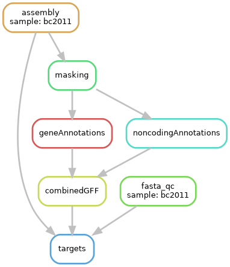
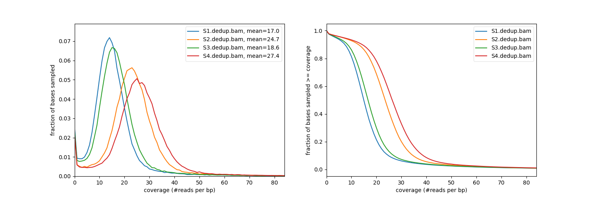
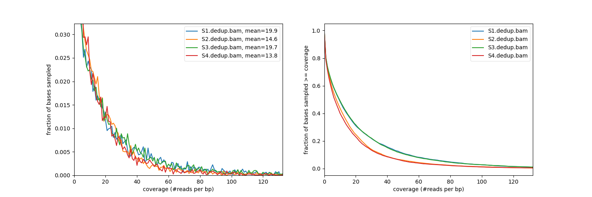
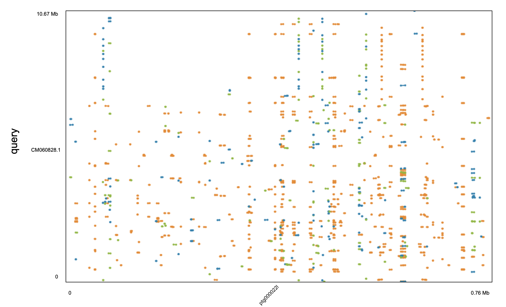
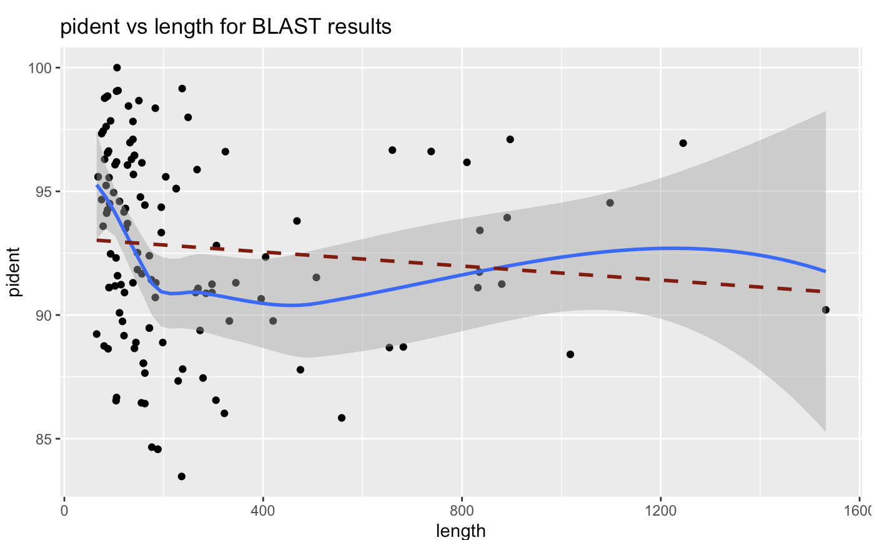
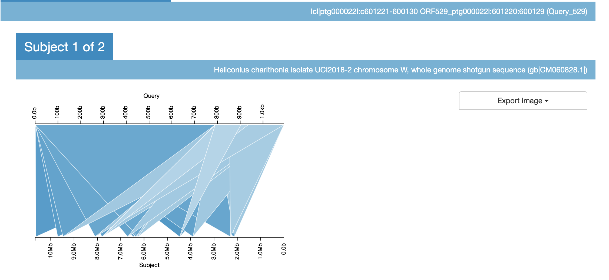

# Genome Work

Of the 5 total coding steps to complete, 3 have been completed and integrated into the pipeline: assembly, fasta_qc, and masking. 

#### Assembly Step
Successfully assembles given HiFi reads into .asm assembly file. The issue with Snakefile not waiting for files to finish was solved by adding a resources argument of `runtime = '6h'`.  
hifiAssembly.sh :
```{bash assembly_step, eval = FALSE}
#!/bin/bash
#SBATCH --mem=100G
#SBATCH --cpus-per-task=48
#SBATCH -c32
#SBATCH --partition scavenger
#SBATCH -t 0-04:00:00

output_name=$1
raw_data=$2
../bin/hifiasm -o ../analysis/snake/${output_name} -t48 ${raw_data} 2> ../logs/${output_name}.log

```

#### Fasta QC
With kmer size 20, analyses the kmers for the fasta files outputted by HiFi assembly. Includes jellyfish and genomescope2.0. The issue with genomescope R packages was solved through conda install bioconda, which installs both argparse and minpack.lm R-specific packages.  
kmerAnalysis.sh : 
```{bash fastqc_step, eval = FALSE}
#!/bin/bash 
#SBATCH --mem=30G
#SBATCH --cpus-per-task=5
#SBATCH --partition scavenger
#SBATCH -t 0-00:10:00

#desired kmer size
kmer=20
output_name=$1
raw_data=$2

#jellyfish
../../bin/jellyfish count -C -m $kmer -s 1000000000 -t 10 ${raw_data} -o ../../analysis/${output_name}.jf
../../bin/jellyfish histo -t 10 ../../analysis/${output_name}.jf > ../../analysis/${output_name}.histo

#genomescope
conda install bioconda::genomescope2

../bin/genomescope2.0/genomescope.R -i ../analysis/${output_name}.histo -o ../results -k $kmer
```

#### Masking
Working on masking code with Krista's starter code currently. This is the current baseline work:  
maskingFasta.sh :
``` {bash maskingFast, eval = FALSE}
#!/bin/bash
#SBATCH --mem=100G
#SBATCH --cpus-per-task=48
#SBATCH -c32
#SBATCH --partition scavenger
#SBATCH -t 0-04:00:00

output_name=$1
data_path=$2

singularity exec -B /work/kp275:/work/alh166 docker://dfam/tetools:latest BuildDatabase -engine ncbi -name hmr  ${data_path}
singularity exec -B /hpc/group/wraylab:/hpc/group/wraylab docker://dfam/tetools:latest RepeatModeler -database hmr -engine ncbi -threads 48 
singularity exec -B /hpc/group/wraylab:/hpc/group/wraylab docker://dfam/tetools:latest RepeatMasker --pa 10 -gff -lib consensi.fa.classified -dir MaskerOutput hmr.p_ctg.fa
```


# Gynandromorph Work 
Working on the gynandromorph was also during this summer and halfway through this semester. My work here included first taking the masked and deduplicated HiFi assembly file and finding the contig covreage for all contigs.  


We know that scaffold 13 is the Z chromosome on H. melpomene. Looking at the contig coverages, several of the visually-significant contigs simply had very low coverage or some other variability. Scaffold 22 looked promising in terms of coverage, so investigated that more.  



I tried using mummer to explore the genome alignment of our genome against some known Ws genomes, but the matches were not very clear and interpretable.  



Then using the terminal command of NCBI blast, I blasted scaffold 22's sequence against several known Ws, and it hit many times in long and significant segments. Below are graphs of the blast hits with e-value vs length and pidentity vs length.  




#### W visualizations
With the terminal use of blast, it does not provide visualizations of the blast match. So I tried different methods of visualizations to varying degrees of success.  


kablammo: confusing images and not an analysis at the entire chromosome level. It is just at the local gene hit area.  
   
   
bioconductor via ggbio - gene model track + ideogram, but we don't have the annotations yet  
IGV web - does not output anything for the blast files i gave it gander blast view - nothing outputted either  


::: {#refs}
:::

\#

::: {#refs}
:::

#refs is to make the reference section pop up first instead of r session info

```{r Session Information}
sessionInfo()
```
